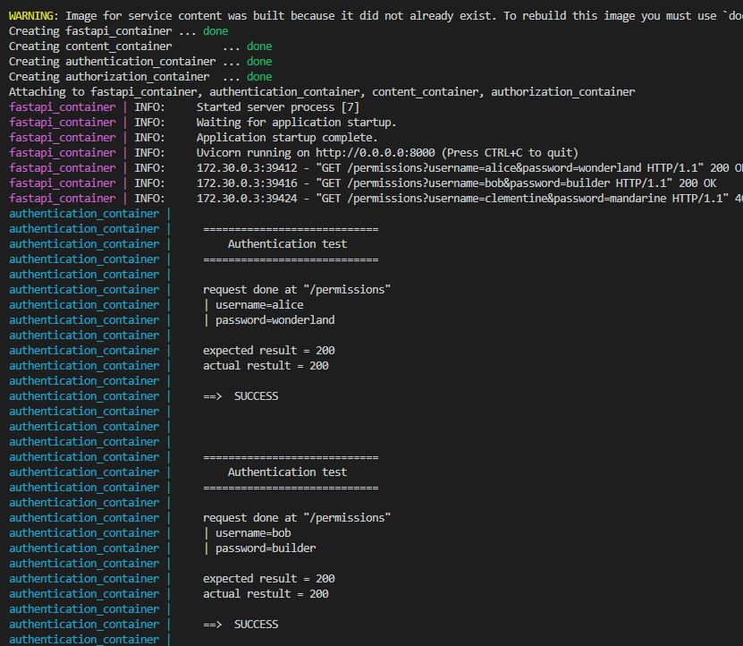
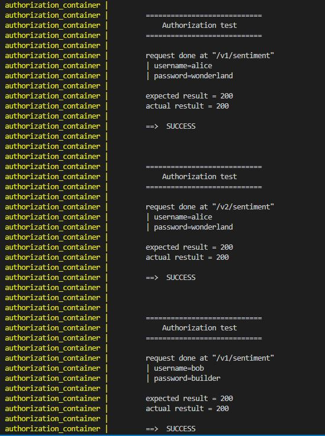
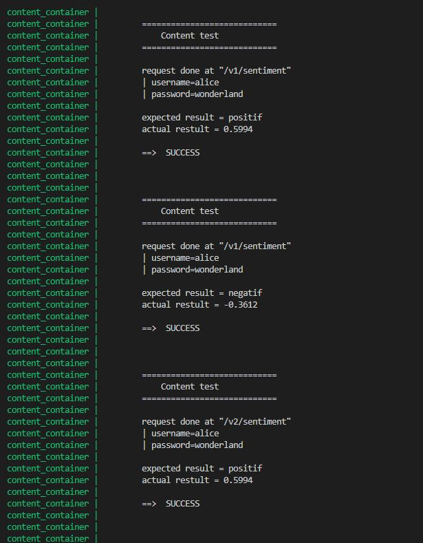

# Docker for tests

The idee is to create a test environment pipeline with Docker for a sentiment analysis API using fastAPI.

# Context

A team has created a sentiment analysis application that can predict whether a sentence has more positive or negative feelings. 
This API will be deployed in a container.

The current image is `datascientest/fastapi:1.0.0` and can be downloaded with :

```bash
docker image pull datascientest/fastapi:1.0.0
```

For manual tests purposes, the API can be lauched as follows:
```bash
docker container run -p 8000:8000 datascientest/fastapi:1.0.0
```
API is available from host at port 8000 and the endpoints `/docs` shows a detailed view of the different endpoints.


# API Endpoints:

| Endpoints | Description |
|----------|------------|
| `/status` | return 1 if API is working correctly |
| `/permissions` | returns user permissions |
| `/v1/sentiment` | return the score for the sentence given in parameters for model in `version 1`|
| `/v2/sentiment` | return the score for the sentence given in parameters for model in `version 2`|

# Permissions

| Username | Password | Permissions | 
|----------|------------|------------|
| `alice` | `wonderland` | [v1,v2] |
| `bob` | `builder` | [v1] |
| `clementine` | `mandarine` | [None] |

# Tests

**Authentication**

Test user authentication at endpoint `/permissions`

**Authorization**

Test user authorization at endpoints `/v1/sentiment` and `/v2/sentiment`

**Content**

Test content of the response when making a request at endpoints `/v1/sentiment` and `/v2/sentiment`
Only user `alice` is used for the test.
Two sentences are given :
- `life is beautiful`
- `that sucks`

**Results**
When the variable `LOG = 1`, the result of test must be printed to a log file `api_test.log`


# File Structure

```
.
├── authentication
│   ├── Dockerfile
│   └── authentication.py
├── authorization
│   ├── Dockerfile
│   └── authorization.py
├── content
│   ├── Dockerfile
│   └── content.py
├── docker-compose.yml
├── log
│   └── api_test.log
└── setup.sh
```
- [docker-compose.yml](docker-compose.yml) :
    - 1 container for the API 
    - 1 container per test (build 1 Dockerfile per test)
- [authentication/](authentication/) : Dockerfile + python file for authentication test.
- [authorization/](authorization/) : Dockerfile + python file for authorization test.
- [content/](content/) : Dockerfile + python file for content test.
- [api_test.log](api_test.log) : log file for test results

# Setup

Start the environment executing [setup.sh](setup.sh)
```bash
./setup.sh
```
# Console Results

### Authentication results


### Authorization results


### Content results



# Manual Results

## `/permissions`

**User** : "alice"
```bash
curl -X GET http://localhost:8000/permissions?username=alice&password=wonderland
```
```json
{"username":"alice","permissions":["v1","v2"]}
```

**User** : "bob"
```bash
curl -X GET http://localhost:8000/permissions?username=bob&password=builder
```
```json
{"username":"bob","permissions":["v1"]}
```

**User** : "clementine"

```bash
curl -X GET http://localhost:8000/permissions?username=clementine&password=mandarine
```
```json
{"detail":"Authentication failed"}
```


## `/v1/sentiment`
**Alice V1**

**Sentence** : "life is beautiful"
```bash
curl -X GET http://localhost:8000/v1/sentiment?username=alice&password=wonderland&sentence=life is beautiful"`
```
```json
{"username":"alice","version":"v1","sentence":"life is beautiful","score":0.5994}
```

**Sentence** : "that sucks"
```bash
curl -X GET http://localhost:8000/v1/sentiment?username=alice&password=wonderland&sentence=that sucks`
```
```json
{"username":"alice","version":"v1","sentence":"that sucks","score":-0.3612}
```

**Bob V1**

**Sentence** : "life is beautiful"
```bash
curl -X GET http://localhost:8000/v1/sentiment?username=bob&password=builder&sentence=life is beautiful
```
```json
{"username":"bob","version":"v1","sentence":"life is beautiful","score":0.5994}
```
**Sentence** : "that sucks"
```bash
curl -X GET http://localhost:8000/v1/sentiment?username=bob&password=builder&sentence=that sucks
```
```json
{"username":"bob","version":"v1","sentence":"that sucks","score":-0.3612}
```

## `/v2/sentiment`

**Alice V2**

**Sentence** : "life is beautiful"
```bash
curl -X GET http://localhost:8000/v2/sentiment?username=alice&password=wonderland&sentence=life is beautiful`
```
```json
{"username":"alice","version":"v2","sentence":"life is beautiful","score":0.5994}
```

**Sentence** : "that sucks"
```bash
curl -X GET http://localhost:8000/v2/sentiment?username=alice&password=wonderland&sentence=that sucks`
```
```json
{"username":"alice","version":"v2","sentence":"that sucks","score":-0.3612}
```

**Bob V2**

**Sentence** : "life is beautiful"
```bash
curl -X GET http://localhost:8000/v2/sentiment?username=bob&password=builder&sentence=life is beautiful
```
```json
{"detail":"This service is not included in your plan."}
```

**Sentence** : "that sucks"
```bash
curl -X GET http://localhost:8000/v2/sentiment?username=bob&password=builder&sentence=that sucks
```
```json
{"detail":"This service is not included in your plan."}
```


